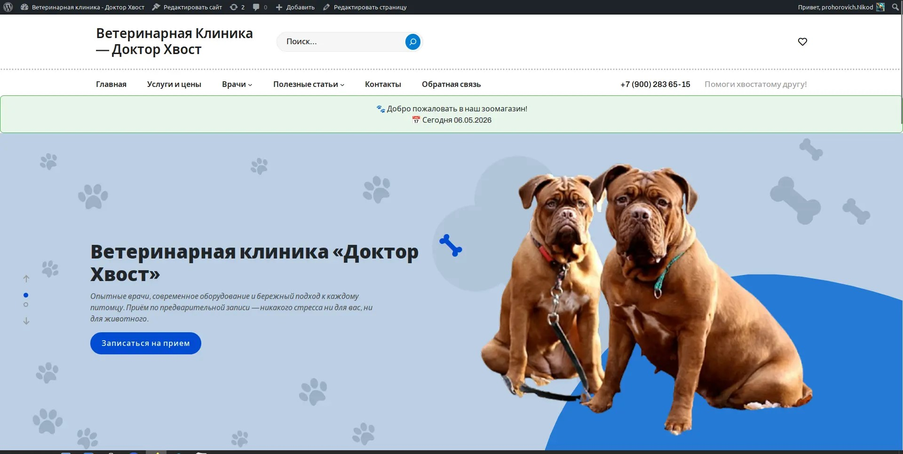
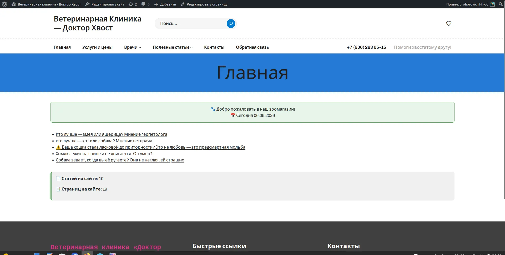

# my-website-project

**Ветеринарная клиника — страница приветствия**

---

## День 7: Работа над проектом

### Проверка кода functions.php

**Дата проверки:** 05.05.2026

---

### Скриншот дня 7



---

### Что сделано

- Обновлена структура проекта
- Добавлены новые файлы
- Настроены Packages

---

### Что проверили

- Наличие PHPDoc-комментариев перед каждой функцией
- Наличие строчных комментариев (//) внутри функций
- Все строки заканчиваются точкой с запятой `;`
- Отсутствие лишних пробелов и пустых строк
- Шорткод `[приветствие]` работает корректно

---

### Результаты проверки

**Найденные замечания:**

> Замечаний нет — всё соответствует стандартам PHP и WordPress Coding Standards.

**Что исправили:**

> (Жалкий пробник)


---

### Проверенная функция

```php
// Шорткод [moi_stati] - список последних 5 статей
function pokazat_stati() {
    $stati = get_posts( array('numberposts' => 5) );
    if ( empty($stati) ) {
        return '<p>📭 Пока нет статей. Добавьте первую запись!</p>';
    }
    $rezultat = '<ul>';
    foreach ( $stati as $stat ) {
        $rezultat .= '<li><a href="' . get_permalink($stat) . '">' . $stat->post_title . '</a></li>';
    }
    $rezultat .= '</ul>';
    return $rezultat;
}
add_shortcode('moi_stati', 'pokazat_stati');

// Шорткод [statistika] - статистика сайта
function statistika_sayta() {
    $kol_state = wp_count_posts()->publish;
    $kol_stranits = wp_count_posts('page')->publish;
    return '<p>📄 Статей на сайте: ' . $kol_state . '</p>
            <p>📑 Страниц на сайте: ' . $kol_stranits . '</p>';
}
add_shortcode('statistika', 'statistika_sayta');

// Шорткод [privetstvie] - приветствие с датой
function privetstvie() {
    $data = date('d.m.Y');
    return '<p>🐾 Добро пожаловать! Сегодня ' . $data . '</p>';
}
add_shortcode('privetstvie', 'privetstvie');
